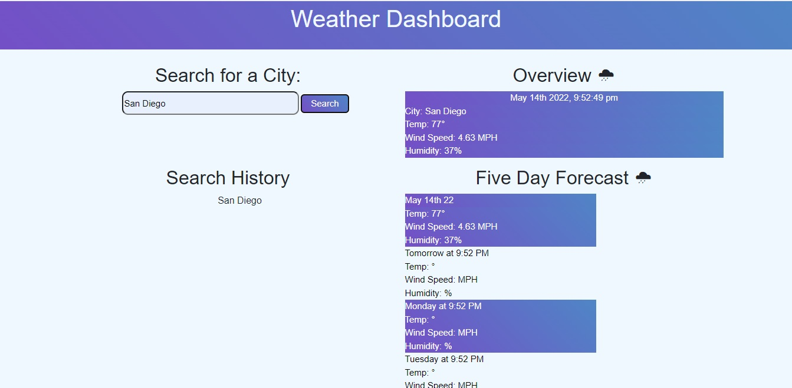

# Weather Tracker 
Weather application powered by the Open Weather API which pulls the live weather outlook for multiple cities, so users can plan accordingly before going outside.

## URls
[Github Pages](https://vcristian1.github.io/weatherApp-demo/)
[Repository](https://github.com/vcristian1/weatherApp-demo)

## Screenshot

